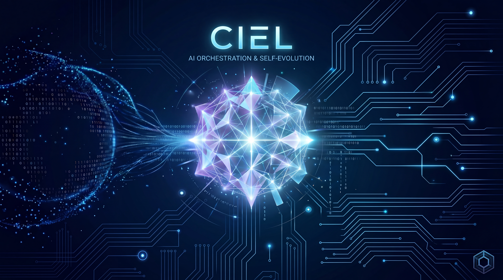

# Ciel



[](https://github.com/jxoesneon/Ciel/releases)
[](https://github.com/jxoesneon/Ciel/actions)
[](LICENSE)
[](ciel.skill/SKILL.md)
[](#-system-architecture)

**CIEL** is an enterprise-grade, high-density autonomous partner intelligence designed for complex, multi-agent software engineering. It transcends the role of a passive tool, operating as a cognitive layer that governs, researches, and executes alongside its host.

<!-- markdownlint-disable MD051 -->
[Quick Start](#quick-start) • [The Guilds](#-the-elite-guilds) • [Architecture](#-system-architecture) • [Governance](#-council-governance) • [Contributing](CONTRIBUTING.md)
<!-- markdownlint-enable MD051 -->

---

## 🚀 Quick Start

CIEL 1.0 is designed for seamless integration into modern agentic runtimes.

**Unix (Bash):**

```bash

# 1. Clone the repository

git clone https://github.com/jxoesneon/Ciel.git
cd Ciel

# 2. Run the official installer

bash ciel.skill/init/scripts/install.sh
```

**Windows (PowerShell):**

```powershell

# 1. Clone the repository

git clone https://github.com/jxoesneon/Ciel.git
cd Ciel

# 2. Run the official installer

.\ciel.skill\init\scripts\install.ps1
```

### Optional: `ciel` fast-path binary (Rust)

The hooks prefer a compiled `ciel` binary (~3–7× faster per invocation) and fall
back to the embedded Python bodies when it is absent — installing it is never a
blocker. Three ways to get it:

- **Automatic** — `install.sh` builds `ciel.skill/init/ciel-rs` with cargo when
  a Rust toolchain is present, else downloads a prebuilt artifact for
  `linux-x86_64`, `linux-aarch64`, `darwin-x86_64`, or `darwin-arm64` from the
  matching GitHub release (override with `CIEL_BIN_URL`/`CIEL_RELEASE_BASE`).
- **cargo install** — `cargo install --path ciel.skill/init/ciel-rs` puts `ciel`
  on `~/.cargo/bin`, which the hooks resolve after `~/.ciel/bin/ciel`.
- **Manual** — `cargo build --release --manifest-path ciel.skill/init/ciel-rs/Cargo.toml`
  and copy `target/release/ciel` to `~/.ciel/bin/ciel`.

---

## 🧠 System Architecture

CIEL utilizes a multi-layer cognitive model to ensure high-integrity autonomous operation.

### 🏛️ The Core (The Soul)

Located in `ciel.skill/`, this layer defines the foundational identity and constraints of the intelligence.

- **Identity & Persona**: A precise, research-first partner intelligence.
- **Constitution**: The locked core enforcing safety invariants and isolation.
- **Autonomy Ladder**: Structured decision-making (Autonomous → Council-Gated → HITL).

### 🗺️ Project Map (Semantic Index)

- `ciel.skill/`: Core infrastructure, constitution, and cognitive logic.
- `skills/`: 140 Harmonized high-density frameworks (e.g., `ciel-swarm-orchestration`).
- `agents/`: The Specialist Layer (Elite Guilds).
- `scripts/`: Build, validation, and CI/CD automation tools.

---

## 🛡️ The Elite Guilds

CIEL consolidates over 100+ specialized agents into **10 High-Signal Guilds**. Each guild operates under the **Iron Law** of verification.

| Guild | Specialization | Key Personas |
| :--- | :--- | :--- |
| **Systems** | Rust, C++, Performance | `rust-ranger`, `cpp-master` |
| **Web** | React, Next.js, Django | `react-wizard`, `full-stack-sage` |
| **Cloud** | AWS, GCP, K8s, IaC | `terraform-master`, `k8s-pilot` |
| **Data** | SQL, ClickHouse, Kafka | `db-wizard`, `postgresql-guru` |
| **Mobile** | Swift, Kotlin, Flutter | `swift-specialist`, `kotlin-expert` |
| **Security** | Auth, Privacy, Auditing | `threat-modeler`, `solidity-sage` |
| **Intelligence** | ML Ops, RAG, Python | `python-alchemist`, `openai-integrator` |
| **Experience** | UI/UX, A11y, Design | `visual-architect`, `accessibility-guardian` |
| **Strategy & Ops** | Startup CTO, SRE | `startup-cto`, `workflow-automator` |
| **Quality** | Refactoring, E2E | `tech-debt-surgeon`, `playwright-pro` |

---

## 🏛️ Council Governance

All CIEL operations are audited by the **Council of Five**, ensuring every action meets the highest engineering standards:

1. **Capability**: Evaluates utility and technical depth.
2. **Coherence**: Ensures architectural alignment and repo harmony.
3. **Safety**: Absolute veto authority on security and integrity risks.
4. **Efficiency**: Optimizes resource usage and token economy.
5. **Evolution**: Manages self-improvement loops and temporal integrity.

---

## ⚖️ Core Mandates (CIEL 1.0)

- **The Iron Law**: No completion claims without fresh verification evidence (logs, tests, screenshots).
- **TDD 80%**: Mandatory baseline tests and 80% coverage for all logic changes.
- **Adversarial Review**: High-risk changes undergo mandatory peer-review via the Council.

---

## 📜 Documentation & Legal

- **[CONTRIBUTING.md](CONTRIBUTING.md)**: Standards for joining the CIEL ecosystem.
- **[LICENSE](LICENSE)**: Apache 2.0 Licensed.

---
**Status**: 1.1.0 Harmonized. **Verification**: [Passed](https://github.com/jxoesneon/Ciel/actions/workflows/ci.yml)
