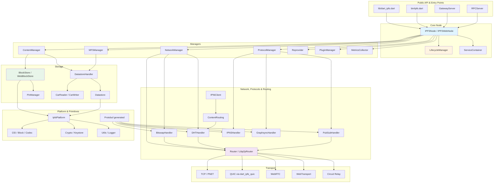

# IPFS — Architecture

Deep-dive into the `dart_ipfs` architecture, design patterns, and runtime organization.

## Design philosophy

`dart_ipfs` is built around modularity, multi-platform support, and testability. The codebase uses a **Manager-Handler** pattern combined with dependency injection, strategy-based codecs, and a platform abstraction layer.

## High-level organization

```
IPFSNode (Facade)
└── LifecycleManager (orchestrator)
    ├── ContentManager
    │   └── UnixFS, IPLD, pinning, add/cat/ls
    ├── NetworkManager
    │   ├── Bitswap, DHT, libp2p transports, routing
    ├── ProtocolManager
    │   ├── PubSub, IPNS, DNSLink, GraphSync
    ├── MFSManager
    ├── Reprovider
    ├── SecurityManager
    ├── PluginManager
    └── ServiceContainer (DI)
```

### General subsystem architecture diagram



## Core managers

### LifecycleManager

Central orchestrator that:

- Initializes managers in the correct order.
- Tracks node states: `Starting`, `Running`, `Stopping`, `Stopped`.
- Coordinates graceful shutdown: closes connections, flushes storage, stops services.
- Registers every `ILifecycle` service.

### ContentManager

Handles the data layer:

- **UnixFS** operations: `add`, `cat`, `ls`, `addDirectory`.
- **MerkleDAG** traversal and pinning.
- Delegates IPLD encoding/decoding to codec strategies (`DagPb`, `DagCbor`, `DagJson`, `DagJose`, `Raw`, `Car`).
- Computes CIDs and stores blocks via `DatastoreHandler`.

### NetworkManager

Owns P2P connectivity:

- Manages libp2p transports (TCP, WebSocket, WebRTC, WebTransport, Circuit Relay, QUIC via `dart_ipfs_quic`).
- Runs **Bitswap** block exchange and provider tracking.
- Runs **Kademlia DHT** for peer/content routing.
- Handles NAT traversal (UPnP/NAT-PMP, AutoNAT, DCUtR).

### ProtocolManager

High-level protocols:

- **PubSub** / Gossipsub (v1.1) real-time messaging.
- **IPNS** mutable naming with Ed25519 signed records.
- **DNSLink** domain-based resolution.
- **GraphSync** graph synchronization with budget enforcement.

### SecurityManager

- Identity: PeerId generation and key management.
- Encrypted keystore: AES-256-GCM + PBKDF2.
- `DenylistService` for content blocking across gateway/RPC/DHT/Bitswap/MFS.
- Rate limiting, CORS, API key auth.

### DatastoreHandler

- Bridges managers to storage backends.
- `BlockStore` interface: `FileStore` (VM) and `IndexedDB` (web via `idb_shim`).
- Metadata persistence through `Datastore`.

### MFSManager & Reprovider

- **MFSManager**: Mutable File System with flush, mv, cp, write-with-offset, stat/ls, chcid.
- **Reprovider**: Periodically re-announces pinned/roots/all CIDs to the DHT with batching and sweep optimization.

## Platform abstraction

`IpfsPlatform` shields core logic from `dart:io` vs browser APIs.

| Platform | Implementation | Storage | Networking |
|----------|----------------|---------|------------|
| Windows/macOS/Linux | `IOPlatform` | `FileStore` / Hive | TCP/UDP/QUIC/WebSocket |
| Browser | `WebPlatform` | `IndexedDB` (`idb_shim`) | WebSocket/WebRTC/WebTransport |

This lets the same `IPFSNode` API work in Flutter mobile, desktop, server, and Dart-web apps.

## Manager-Handler pattern

Managers delegate protocol specifics to handlers/strategies so new protocols can be added without editing core managers:

- `NetworkManager` → `BitswapHandler`, `DHTHandler`.
- `ContentManager` → `IPLDCodec` strategies (`RawCodec`, `DagPbCodec`, `DagCborCodec`, `DagJsonCodec`, `DagJoseCodec`).
- `ProtocolManager` → `PubSubHandler`, `IPNSHandler`, `GraphSyncHandler`.

## Key design patterns

1. **ILifecycle** — every long-running service implements `start()` / `stop()` and registers with `LifecycleManager`.
2. **Strategy** — IPLD codecs are interchangeable strategies.
3. **Dependency Injection** — `ServiceContainer` resolves manager/handler dependencies.
4. **Facade** — `IPFSNode` exposes a simple API over the complex manager graph.

## Data flow examples

### Adding a file

```
IPFSNode.addFile(data)
  → ContentManager.addFile()
    → UnixFS chunking
    → IPLDCodec.encode()  (DagPb / DagCbor / Raw)
    → DatastoreHandler.putBlock()  → BlockStore
    → CID computed
  → NetworkManager.announceToDHT(cid)
  → BitswapHandler.serveBlocks()
```

### Retrieving content

```
IPFSNode.cat(cid)
  → ContentManager.cat()
    → DatastoreHandler.getBlock(cid)
      → if local: return block
      → if missing: BitswapHandler.requestBlock()
        → DHTHandler.findProviders(cid)
        → NetworkHandler.connectToPeer(provider)
        → fetch block
    → IPLDCodec.decode()
    → assemble UnixFS chunks
```

## Networking stack

Transports and protocols implemented in native Dart:

- **Transports**: TCP, WebSocket, WebRTC, WebTransport, Circuit Relay v2, QUIC (via `dart_ipfs_quic` / `quic_lib`).
- **Security**: Noise protocol for encrypted handshakes; libp2p TLS 1.3 for QUIC.
- **Stream multiplexing**: Yamux and Mplex.
- **Discovery**: mDNS (local), Kademlia DHT (global), bootstrap peers.

## Public API surface

The umbrella `lib/dart_ipfs.dart` re-exports:

- From `dart_ipfs_core`: `CID`, `Block`, `IBlockStore`, `IPLDCodec`, `RawCodec`, `DagCborCodec`, `DagJsonCodec`, `CryptoUtils`, `Ed25519Signer`, etc.
- From `dart_ipfs_quic`: `QuicTransport`, `QuicConnection`, `QuicListener`.
- Umbrella-specific: `IPFSNode`, `IPFSWebNode`, `IPFSConfig`, `CarReader`/`CarWriter`, `PubSubMessage`.

Deep imports of `package:dart_ipfs/src/...` are deprecated and will be removed in v3.0.0.

## Monorepo tiers

| Tier | Location | Stability | Examples |
|------|----------|-----------|----------|
| Tier 1 — Stable Core | `packages/dart_ipfs_core/lib/` | Spec-defined, low churn | `CID`, `Block`, `IBlockStore`, `IPLDCodec`, `Ed25519Signer` |
| Tier 2 — Umbrella Public | `lib/dart_ipfs.dart` | Public API, may evolve | `IPFSNode`, `GatewayServer`, `RPCServer`, `IPNSHandler` |
| Tier 3 — Unstable Internals | `lib/src/...` | Not public API | Deep imports (deprecated) |

## Key files

- `lib/dart_ipfs.dart` — public barrel.
- `lib/src/core/ipfs_node/ipfs_node.dart` — main facade and manager wiring.
- `lib/src/core/ipfs_node/lifecycle_manager.dart` — orchestration.
- `doc/ARCHITECTURE.md` — original architecture guide.
- `doc/monorepo.md` — monorepo layout and stability tiers.

## Subsystem deep-dives

- [[ciel/projects/IPFS/subsystems/core.md|IPFS — Core Node & Manager Architecture]]
- [[ciel/projects/IPFS/subsystems/network-protocols-routing.md|IPFS — Network, Protocols & Routing]]
- [[ciel/projects/IPFS/subsystems/services.md|IPFS — Gateway, RPC & Pinning Services]]
- [[ciel/projects/IPFS/subsystems/storage.md|IPFS — Storage Architecture]]
- [[ciel/projects/IPFS/subsystems/platform-utils-cli.md|IPFS — Platform Abstraction, Utilities & CLI]]
- [[ciel/projects/IPFS/subsystems/proto.md|IPFS — Protobuf Messaging System]]
- [[ciel/projects/IPFS/subsystems/transport.md|IPFS — Transport Layer]]

## Related

- [[ciel/projects/IPFS/knowledgebase.md|IPFS — Knowledgebase]]
- [[ciel/projects/IPFS/specs-and-compliance.md|IPFS — Specs & Compliance]]
- [[ciel/projects/IPFS/build-test-ci.md|IPFS — Build, Test & CI]]
- [[ciel/projects/IPFS/dependencies-and-monorepo.md|IPFS — Dependencies & Monorepo]]
- [[ciel/projects/IPFS/security-and-traps.md|IPFS — Security & Traps]]
- [[ciel/projects/IPFS/git-state.md|IPFS — Git State]]
