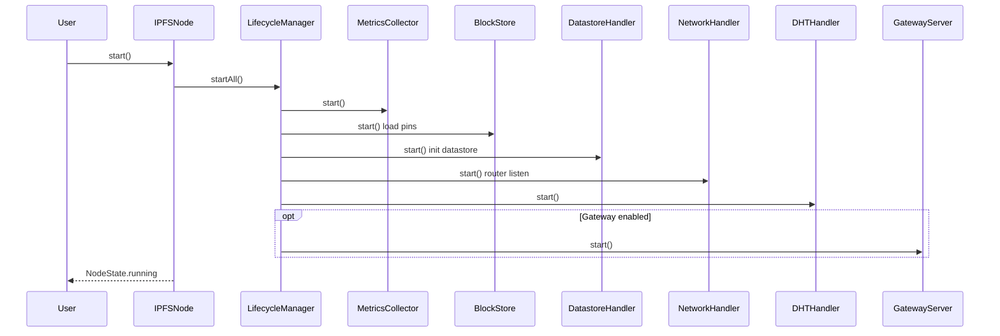

# IPFS — Core Node & Manager Architecture

This note drills into the `lib/src/core/` subsystem of `dart_ipfs`: the node facade, lifecycle orchestration, managers, dependency injection, plugin system, metrics, and configuration model.

## Scope

- `lib/src/core/ipfs_node/` — node orchestrators and lifecycle managers.
- `lib/src/core/builders/` & `lib/src/core/di/` — builder and dependency injection.
- `lib/src/core/config/` — all configuration classes.
- `lib/src/core/mfs/` — Mutable File System.
- `lib/src/core/plugins/` — plugin host, manager, and capability registry.
- `lib/src/core/metrics/` — telemetry collection.

## Key components

### Node facades

| Class | File | Role |
|-------|------|------|
| `IPFSNode` | `lib/src/core/ipfs_node/ipfs_node.dart` | Main facade; high-level API for content, networking, IPNS, PubSub, MFS, and plugins. |
| `IPFSWebNode` | `lib/src/core/ipfs_node/ipfs_web_node.dart` | Browser-specific offline node using `WebBlockStore` and delegated DHT. |
| `IPFSNodeBuilder` | `lib/src/core/builders/ipfs_node_builder.dart` | Constructs the node, registers services in `ServiceContainer`, wires managers. |
| `ServiceContainer` | `lib/src/core/di/service_container.dart` | Thin wrapper around `GetIt` for dependency injection. |

### Lifecycle orchestration

`LifecycleManager` (`lib/src/core/ipfs_node/lifecycle_manager.dart`) is the central orchestrator:

- Services register as `ILifecycle`.
- `startAll()` starts services in registration order.
- `stopAll()` stops services in reverse order.
- Startup failures trigger automatic rollback (`stopAll()` on already-started services) and the node transitions to `error`.

### Managers

| Manager | Primary responsibilities |
|---------|----------------------------|
| `ContentManager` | `addFile`, `addDirectory`, `get`, `ls`, `pin`, `unpin`; bridges UnixFS/IPLD, `DatastoreHandler`, `BlockStore`, `BitswapHandler`, and `DenylistService`. |
| `NetworkManager` | Peer connectivity, provider discovery, `requestBlock`, delegates to `NetworkHandler`, `DHTHandler`, `ContentRoutingHandler`. |
| `ProtocolManager` | PubSub, IPNS, DNSLink coordination; delegates to `PubSubHandler`, `DHTHandler`, `IPNSHandler`, `ContentRoutingHandler`. |
| `MFSManager` | Mutable File System operations (`mkdir`, `cp`, `mv`, `rm`, `ls`, `stat`, `read`, `write`) with Kubo-compatible stat/list formats. |
| `Reprovider` | Periodic re-announcement of pinned/root CIDs to the DHT. |

### Network-adjacent handlers registered in core

| Handler | Role |
|---------|------|
| `NetworkHandler` | Platform-specific router management, circuit relay, AutoNAT dialback registration. |
| `AutoNATHandler` | Spec-compliant NAT detection and periodic dialback tests (~30 min). |
| `BootstrapHandler` | Connects to bootstrap peers and reconnects every 5 minutes. |
| `MDNSHandler` | Local peer discovery via multicast DNS. |
| `ContentRoutingHandler` | DHT-based provider discovery with delegated routing fallback and DNSLink resolution. |
| `DNSLinkHandler` | DNSLink resolution with caching (30-minute TTL). |
| `IPLDHandler` | IPLD codec registry, schema validation, selector execution, path resolution. |
| `PubSubHandler` | PubSub topic subscription and message routing. |

### Storage & MFS helpers

| Component | Role |
|-----------|------|
| `DatastoreHandler` | Wraps `Datastore` for block operations and CAR import/export. |
| `BlockStore` / `WebBlockStore` | Content-addressed block storage for VM and web. |
| `PinManager` | Direct/recursive pinning and pin-state persistence. |

See [[ciel/projects/IPFS/subsystems/storage.md|IPFS — Storage subsystem]] for the storage deep-dive.

### Plugin system

| Component | Role |
|-----------|------|
| `PluginHost` | Validates, loads, and starts in-process plugins; Ed25519 signature verification; deny-by-default capability ACLs. |
| `PluginManager` | Registers plugins and calls lifecycle hooks (`onInit`, `onStart`, `onStop`). |
| `CapabilityRegistry` | Defines canonical capabilities (`blockstore.read`, `network.bitswap.observe`, `metrics.emit`, `gateway.observe`, `pin.add`) and audits every check. |

### Metrics

`MetricsCollector` (`lib/src/core/metrics/metrics_collector.dart`) exposes Prometheus-compatible metrics:

- Messages sent/received and bytes per protocol.
- Peer connection counts, routing table size, latency observations.
- Blockstore size, gateway/RPC request totals, DHT provide/reprovide operations.

## Core component diagram

```mermaid
graph TB
    subgraph "Application"
        CLI[CLI bin/ipfs.dart]
        Gateway[GatewayServer]
        RPC[RPCServer]
    end

    subgraph "Node Facade"
        IPFSNode[IPFSNode]
        IPFSWebNode[IPFSWebNode]
    end

    subgraph "Lifecycle"
        LM[LifecycleManager]
        IL[ILifecycle interface]
    end

    subgraph "Managers"
        CM[ContentManager]
        NM[NetworkManager]
        PM[ProtocolManager]
        MFS[MFSManager]
        RP[Reprovider]
        PLM[PluginManager]
        MC[MetricsCollector]
    end

    subgraph "Handlers"
        NH[NetworkHandler]
        ANH[AutoNATHandler]
        BH[BootstrapHandler]
        MDNS[MDNSHandler]
        CRH[ContentRoutingHandler]
        DNH[DNSLinkHandler]
        IPLDH[IPLDHandler]
        PSH[PubSubHandler]
    end

    subgraph "Storage"
        DH[DatastoreHandler]
        BS[BlockStore / WebBlockStore]
        PIN[PinManager]
    end

    subgraph "Dependency Injection"
        SC[ServiceContainer]
    end

    CLI --> IPFSNode
    Gateway --> IPFSNode
    RPC --> IPFSNode

    IPFSNode --> LM
    IPFSNode --> SC
    IPFSNode --> CM
    IPFSNode --> NM
    IPFSNode --> PM
    IPFSNode --> MFS
    IPFSNode --> PLM
    IPFSNode --> MC

    LM --> IL
    CM ..|> IL
    NM ..|> IL
    PM ..|> IL
    MFS ..|> IL
    MC ..|> IL
    BS ..|> IL
    DH ..|> IL
    NH ..|> IL
    ANH ..|> IL
    BH ..|> IL
    MDNS ..|> IL
    CRH ..|> IL
    DNH ..|> IL
    IPLDH ..|> IL
    PSH ..|> IL

    CM --> DH
    CM --> BS
    CM --> Bitswap[BitswapHandler]
    CM --> Denylist[DenylistService]

    NM --> NH
    NM --> DHT[DHTHandler]
    NM --> CRH
    NM --> Bitswap

    PM --> PSH
    PM --> DHT
    PM --> IPNS[IPNSHandler]
    PM --> CRH

    MFS --> BS
    MFS --> Datastore
    MFS --> Denylist

    BS --> PIN
    DH --> Datastore

    NH --> Router[RouterInterface / Libp2pRouter]
    NH --> Circuit[CircuitRelayClient]
    ANH --> NH
    BH --> NH
    CRH --> NH
    PSH --> Router

    PLM --> Plugins[IPFSPlugin instances]

    style IPFSNode fill:#e1f5ff
    style LM fill:#fff4e1
    style BS fill:#e8f5e9
```

## Node startup sequence



## Configuration model

`IPFSConfig` (`lib/src/core/config/ipfs_config.dart`) aggregates subsystem configs:

| Config class | Concern |
|--------------|---------|
| `NetworkConfig` | Listen/bootstrap addresses, transport flags (TCP/QUIC/WebRTC/WebTransport), STUN/TURN, circuit relay, PNET. |
| `DHTConfig` | Kademlia `alpha`, bucket size, max providers, reprovider interval/strategy. |
| `StorageConfig` | Repo path, blockstore strategy, cache size. |
| `SecurityConfig` | API key, CORS, rate limits, denylist. |
| `GatewayConfig` | Port, TLS/AutoTLS, subdomain gateway, writable flag. |
| `BitswapConfig` | Wantlist limits, ledger rules, HTTP fallback. |
| `GraphsyncConfig` | Selector budgets, enabled flag. |
| `MetricsConfig` | Collection interval, Prometheus export. |

## Key files

| File | Purpose |
|------|---------|
| `lib/src/core/ipfs_node/ipfs_node.dart` | Main facade and public API. |
| `lib/src/core/ipfs_node/ipfs_web_node.dart` | Browser node variant. |
| `lib/src/core/ipfs_node/lifecycle_manager.dart` | Service orchestration. |
| `lib/src/core/builders/ipfs_node_builder.dart` | Node construction and DI wiring. |
| `lib/src/core/di/service_container.dart` | DI container wrapper. |
| `lib/src/core/mfs/mfs_manager.dart` | MFS implementation. |
| `lib/src/core/plugins/plugin_host.dart` | Plugin loading and ACLs. |
| `lib/src/core/plugins/capability_registry.dart` | Capability registry. |
| `lib/src/core/metrics/metrics_collector.dart` | Prometheus-compatible telemetry. |
| `lib/src/core/config/ipfs_config.dart` | Top-level configuration. |

## Related

- [[ciel/projects/IPFS/knowledgebase.md|IPFS — Knowledgebase]]
- [[ciel/projects/IPFS/architecture.md|IPFS — Architecture]]
- [[ciel/projects/IPFS/subsystems/storage.md|IPFS — Storage subsystem]]
- [[ciel/projects/IPFS/subsystems/network-protocols-routing.md|IPFS — Network, Protocols & Routing subsystem]]
- [[ciel/projects/IPFS/subsystems/transport.md|IPFS — Transport subsystem]]
- [[ciel/projects/IPFS/subsystems/services.md|IPFS — Services subsystem]]
