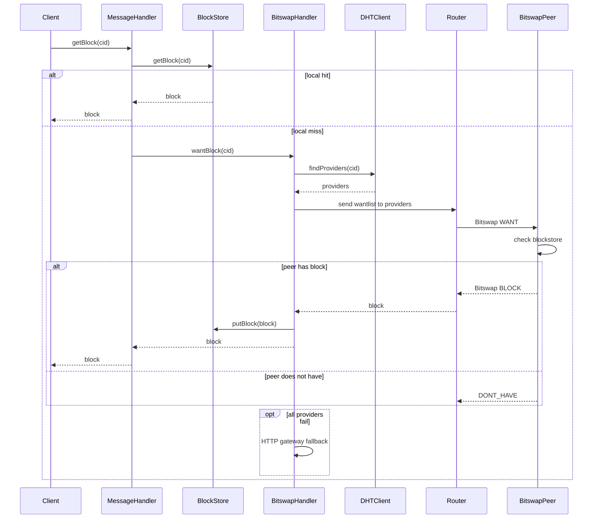
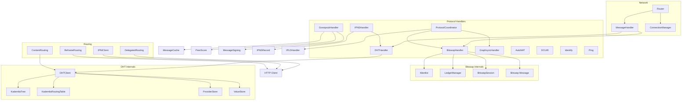

# IPFS — Network, Protocols & Routing

This note covers the `lib/src/network/`, `lib/src/protocols/`, and `lib/src/routing/` subsystems of `dart_ipfs`: the message router, protocol handlers, and content-routing strategies.

## Scope

- `lib/src/network/` — `Router`, `MessageHandler`, `ConnectionManager`, `Libp2pNode` abstraction.
- `lib/src/protocols/` — Bitswap, DHT/Kademlia, PubSub/Gossipsub, IPNS, GraphSync, AutoNAT, DCUtR, Identify, Ping.
- `lib/src/routing/` — content routing, delegated routing, IPNI, Reframe.

## Network layer (`lib/src/network/`)

| Component | File | Role |
|-----------|------|------|
| `Router` | `router.dart` | High-level message router; tracks connected peers, sends/broadcasts messages, connects/disconnects. |
| `MessageHandler` | `message_handler.dart` | Receives CID messages, stores blocks, fetches via Bitswap, notifies listeners via event stream and PubSub `content_updates`. |
| `ConnectionManager` | `connection_manager.dart` | Peer connection state, timestamps, byte/message counters, latency metadata. |
| `Libp2pNode` | `libp2p_node.dart` | Protocol/transport/security/multiplexer configuration abstraction (currently a stub). |

## Protocol handlers

### Bitswap (`lib/src/protocols/bitswap/`)

Implements **Bitswap 1.2.0** (`/ipfs/bitswap/1.2.0`) with 1.0/1.1 compatibility.

| Component | Role |
|-----------|------|
| `BitswapHandler` | Main handler: wantlist, block serving/presence, ledgers, gateway fallback, DoS limits (max 5,000 wantlist entries). |
| `Bitswap` | Credit-based exchange variant. |
| `BitswapSession` | Bitswap 1.4 session-aware fetching with latency-based peer targeting. |
| `Message` | Protobuf wire-format encoding/decoding, CID prefix reconstruction. |
| `Wantlist` | Priority-ordered CID request list. |
| `Ledger` | Per-peer byte debt tracking. |

**Block retrieval flow**

### DHT/Kademlia (`lib/src/protocols/dht/`)

Implements **IPFS Kademlia DHT 1.0.0** (`/ipfs/kad/1.0.0`) with `α=3`, `K=20`.

| Component | Role |
|-----------|------|
| `DHTHandler` | High-level DHT API: `findProviders`, `putValue`, `getValue`, `resolveIPNS`, `publishIPNS`. |
| `DHTClient` | Iterative Kademlia lookups, provider announcements, routing table bootstrap. |
| `DHTProtocol` | Closest-peer lookup, `FIND_NODE` handling. |
| `KademliaRoutingTable` | k-buckets with IP diversity (max 2 peers per IP) and stale eviction. |
| `KademliaTree` | Tree-structured Kademlia with 256 buckets, value/provider stores, refresh/republish. |
| `XORDistanceMetric` | XOR distance for peer ID comparison. |
| `DHTEnvelope` | Request/response framing with request IDs. |

**Security controls**

- Wantlist size capped at 5,000 entries.
- Provider record verification (SEC-010), max 20 providers per CID.
- 10 provider announcements per peer per minute.
- IP diversity enforcement in routing table.

### PubSub / Gossipsub (`lib/src/protocols/pubsub/`)

Implements **Gossipsub v1.1** (`/meshsub/1.1.0`), protobuf wire format.

| Component | Role |
|-----------|------|
| `GossipsubHandler` | Topic subscriptions, mesh maintenance, message publishing, peer scoring. |
| `MessageCache` | Deduplication by `(topic, sender, seqno)`. |
| `MessageSigning` | Ed25519 signing/verification. |
| `PeerScore` | Spam-protection peer scoring. |

Control messages: `SUBSCRIBE`, `UNSUBSCRIBE`, `PUBLISH`, `IHAVE`, `IWANT`, `GRAFT`, `PRUNE`.

### IPNS (`lib/src/protocols/ipns/`)

Implements **IPNS V2** with Ed25519 signatures and legacy fallback.

| Component | Role |
|-----------|------|
| `IPNSHandler` | Resolve/publish IPNS names; DHT-backed with optional Gossipsub notifications on `/ipfs/ipns-1.0.0`; MRU cache with TTL. |
| `IPNSRecord` | CBOR V2 record creation/validation; V1 signature support. |

### GraphSync (`lib/src/protocols/graphsync/`)

Implements **GraphSync 1.2.0** (`/ipfs/graphsync/1.2.0`).

| Component | Role |
|-----------|------|
| `GraphsyncHandler` | Server/client DAG transfer, selector execution, bidirectional pause/resume, Bitswap fallback. |
| `GraphsyncProtocol` / `GraphsyncTypes` | Message definitions and status codes. |
| `GraphsyncBudget` | Block-count and byte-size budget enforcement per request. |

### Auxiliary protocols

| Protocol | ID | Handler | Purpose |
|----------|----|---------|---------|
| AutoNAT | `/ipfs/autonat/1.0.0` | `autonat_protocol.dart` | NAT status via dialback. |
| DCUtR | hole punching | `dcutr_handler.dart` | Direct connection upgrade through relay. |
| Identify | `/ipfs/id/1.0.0` | `identify_handler.dart` | Peer info exchange, supported protocols, agent version `dart_ipfs/1.11.5`. |
| Ping | `/ipfs/ping/1.0.0` | `ping_handler.dart` | 32-byte echo liveness / RTT. |

## Routing layer (`lib/src/routing/`)

| Component | Role |
|-----------|------|
| `ContentRouting` | DHT-based `findProviders` / `provide`, DNSLink resolution. |
| `DelegatedRouting` | HTTP delegated routing V1 against `https://delegated-ipfs.dev`. |
| `IPNIClient` | InterPlanetary Network Indexer client (default `https://cid.contact`). |
| `ReframeRouting` | Reframe delegated routing client. |
| `ProtocolCoordinator` | Coordinates Bitswap → GraphSync → IPLD fallback for retrievals. |

## Protocol & routing component diagram

## Key files

### Network

| File | Lines | Purpose |
|------|-------|---------|
| `lib/src/network/libp2p_node.dart` | 28 | Protocol/transport configuration stub. |
| `lib/src/network/router.dart` | 76 | High-level peer message router. |
| `lib/src/network/message_handler.dart` | 239 | CID processing and content dispatch. |
| `lib/src/network/connection_manager.dart` | 49 | Connection metrics. |

### Bitswap

| File | Lines | Purpose |
|------|-------|---------|
| `lib/src/protocols/bitswap/bitswap_handler.dart` | 704 | Main Bitswap 1.2.0 handler. |
| `lib/src/protocols/bitswap/message.dart` | 372 | Wire format. |
| `lib/src/protocols/bitswap/wantlist.dart` | 62 | Priority wantlist. |
| `lib/src/protocols/bitswap/ledger.dart` | 125 | Ledger manager. |

### DHT

| File | Lines | Purpose |
|------|-------|---------|
| `lib/src/protocols/dht/dht_handler.dart` | 543 | High-level DHT operations. |
| `lib/src/protocols/dht/dht_client.dart` | 1434 | Kademlia client. |
| `lib/src/protocols/dht/kademlia_routing_table.dart` | 490 | k-bucket routing table. |
| `lib/src/protocols/dht/kademlia_tree.dart` | 560 | Tree-structured Kademlia. |

### Other protocols

| File | Purpose |
|------|---------|
| `lib/src/protocols/pubsub/gossipsub/gossipsub_handler.dart` | Gossipsub v1.1 handler. |
| `lib/src/protocols/ipns/ipns_handler.dart` | IPNS resolution/publishing. |
| `lib/src/protocols/ipns/ipns_record.dart` | IPNS V2 records. |
| `lib/src/protocols/graphsync/graphsync_handler.dart` | GraphSync handler. |
| `lib/src/protocols/autonat/autonat_protocol.dart` | AutoNAT dialback. |
| `lib/src/protocols/dcutr/dcutr_handler.dart` | Hole punching. |
| `lib/src/protocols/identify/identify_handler.dart` | Identify protocol. |
| `lib/src/protocols/ping/ping_handler.dart` | Ping liveness. |

### Routing

| File | Purpose |
|------|---------|
| `lib/src/routing/content_routing.dart` | DHT content routing. |
| `lib/src/routing/delegated_routing.dart` | HTTP delegated routing. |
| `lib/src/routing/ipni_client.dart` | IPNI indexer client. |
| `lib/src/routing/reframe_routing.dart` | Reframe routing. |
| `lib/src/protocols/protocol_coordinator.dart` | Multi-protocol retrieval coordinator. |

## Related

- [[ciel/projects/IPFS/knowledgebase.md|IPFS — Knowledgebase]]
- [[ciel/projects/IPFS/subsystems/core.md|IPFS — Core subsystem]]
- [[ciel/projects/IPFS/subsystems/transport.md|IPFS — Transport subsystem]]
- [[ciel/projects/IPFS/subsystems/storage.md|IPFS — Storage subsystem]]
- [[ciel/projects/IPFS/subsystems/services.md|IPFS — Services subsystem]]
- [[ciel/projects/IPFS/subsystems/proto.md|IPFS — Protobuf subsystem]]
