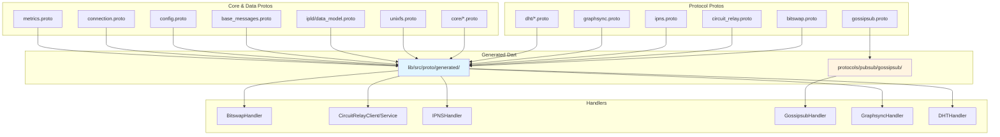

# IPFS — Protobuf Messaging System

This note drills into the protobuf layer of `dart_ipfs`: `.proto` definitions under `lib/src/proto/`, generated Dart code in `lib/src/proto/generated/`, and how each protocol maps to its messages.

## Scope

- `lib/src/proto/**/*.proto` — message definitions.
- `lib/src/proto/generated/**/*.pb.dart` — generated Dart classes.
- `Makefile` `protos` / `clean-protos` targets for regeneration.

## Proto file organization

### Protocol-specific protos

| Protocol | Proto file | Package | Syntax | Key messages |
|----------|------------|---------|--------|--------------|
| Bitswap | `lib/src/proto/bitswap/bitswap.proto` | `ipfs.bitswap` | proto3 | `Message`, `Wantlist`, `Wantlist.Entry`, `Block`, `BlockPresence` |
| Circuit Relay | `lib/src/proto/circuit_relay.proto` | `circuit_relay` | proto3 | `HopMessage`, `StopMessage`, `Peer`, `Reservation`, `Limit`, `Status` |
| IPNS | `lib/src/proto/ipns.proto` | `ipfs.ipns` | proto3 | `IpnsEntry` (V1/V2 signatures) |
| Gossipsub | `lib/src/protocols/pubsub/gossipsub/gossipsub.proto` | `gossipsub` | **proto2** | `RPC`, `Subscription`, `Message`, `ControlMessage`, `ControlIHave`, `ControlIWant`, `ControlGraft`, `ControlPrune`, `PeerInfo` |
| GraphSync | `lib/src/proto/graphsync/graphsync.proto` | `ipfs.graphsync` | proto3 | `GraphsyncMessage`, `GraphsyncRequest`, `GraphsyncResponse`, `Block`, `ResponseStatus` |
| DHT | `lib/src/proto/dht/*.proto` | `ipfs.dht` | proto3 | `DHTPeer`, `Record`, `FindProviders`, `Provide`, `FindValue`, `PutValue`, `FindNode`, Kademlia messages, network events |

### Core data structure protos

| Area | Proto file(s) | Key messages |
|------|---------------|--------------|
| Core types | `lib/src/proto/core/*.proto` | `IPFSCIDProto`, `BlockProto`, `PeerProto`, `PBNode`, `PBLink`, `PinProto`, `BitFieldProto`, operation logs |
| UnixFS | `lib/src/proto/unixfs/unixfs.proto` | `Data` (Raw/Directory/File/Metadata/Symlink/HAMTShard), `Metadata` |
| IPLD | `lib/src/proto/ipld/data_model.proto` | `IPLDNode`, `IPLDList`, `IPLDMap`, `IPLDLink`, `Kind` enum |

### Infrastructure protos

| File | Package | Purpose |
|------|---------|---------|
| `base_messages.proto` | `ipfs.base` | `IPFSMessage` wrapper and `NetworkEvent`. |
| `config.proto` | `ipfs.config` | `ProtocolConfig`, `RateLimitConfig`, `CircuitBreakerConfig`. |
| `connection.proto` | `ipfs.connection` | `ConnectionState`, `ConnectionMetrics`. |
| `metrics.proto` | `ipfs.metrics` | `NetworkMetrics`, `PeerMetrics`, `ProtocolMetrics`. |
| `validation.proto` | — | Validation structures. |
| `webrtc.proto` | — | WebRTC signaling structures. |

### Well-known types

`lib/src/proto/google/protobuf/` contains 15 standard Google protobuf files (any, api, descriptor, duration, empty, field_mask, struct, timestamp, type, wrappers, etc.).

## Generated Dart layout

Generated files follow the convention:

```
lib/src/proto/generated/
├── <name>.pb.dart       # message classes
├── <name>.pbenum.dart   # enums
└── <name>.pbjson.dart   # JSON serialization
```

Special cases:

- `core/blockstore.pbgrpc.dart` and `core/blockstore.pbserver.dart` — gRPC server code for blockstore.
- Gossipsub generated files live alongside implementation at `lib/src/protocols/pubsub/gossipsub/gossipsub.pb.dart` rather than under `generated/`.

## Protocol-to-message mapping

### Bitswap

- Proto: `lib/src/proto/bitswap/bitswap.proto`
- Generated: `lib/src/proto/generated/bitswap/bitswap.pb.dart`
- Usage: `bitswap_handler.dart`, `message.dart`, `ledger.dart`, `core/interfaces/block.dart`
- Key operations: wantlist priority/type, block transfer with CID prefix, `HAVE`/`DONT_HAVE` presence.

### DHT

- Protos: `dht/dht.proto`, `dht/kademlia.proto`, `dht/dht_messages.proto`, `dht/common_kademlia.proto`, `dht/ipfs_node_network_events.proto`, plus many split files.
- Generated: `lib/src/proto/generated/dht/*.pb.dart`
- Usage: `dht_client.dart`, `dht_handler.dart`, `kademlia_tree/`, `routing_table.dart`, `network_handler_io.dart`
- Key operations: `PUT_VALUE`, `GET_VALUE`, `ADD_PROVIDER`, `GET_PROVIDERS`, `FIND_NODE`, `PING`, 34+ network event types.

### IPNS

- Proto: `lib/src/proto/ipns.proto`
- Generated: `lib/src/proto/generated/ipns.pb.dart`
- Usage: `ipns_record.dart`, `ipns_handler.dart`
- Key operations: V1/V2 Ed25519 signatures, sequence numbers, TTL, validity.

### PubSub / Gossipsub

- Proto: `lib/src/protocols/pubsub/gossipsub/gossipsub.proto` (proto2)
- Generated: `lib/src/protocols/pubsub/gossipsub/gossipsub.pb.dart`
- Usage: `gossipsub_handler.dart`, `message_cache.dart`, `message_signing.dart`
- Key operations: RPC envelope, subscriptions, publish, control messages (`IHAVE`, `IWANT`, `GRAFT`, `PRUNE`), peer exchange info.

### Circuit Relay

- Proto: `lib/src/proto/circuit_relay.proto`
- Generated: `lib/src/proto/generated/circuit_relay.pb.dart`
- Usage: `transport/circuit_relay_client_io.dart`, `transport/circuit_relay_service.dart`
- Key operations: HOP (`RESERVE`, `CONNECT`, `STATUS`), STOP (`CONNECT`, `STATUS`), reservations with limits.

### GraphSync

- Proto: `lib/src/proto/graphsync/graphsync.proto`
- Generated: `lib/src/proto/generated/graphsync/graphsync.pb.dart`
- Usage: `protocols/graphsync/graphsync_handler.dart`, `graphsync_protocol.dart`, `graphsync_budget.dart`
- Key operations: request/response IDs, root CID, selector, pause/cancel, status codes.

## Protobuf build process

```bash
make protos      # regenerate all .pb.dart files
make clean-protos # remove orphaned .pb.dart files
```

Toolchain: `protoc` + Dart protobuf plugin. `pubspec.yaml` declares `protobuf: ^6.0.0`.

## Proto subsystem diagram



## Observations

- Most protos use **proto3**; Gossipsub is the notable **proto2** exception (libp2p spec compatibility).
- DHT has the richest proto surface, split across many focused files.
- Gossipsub is the only major protocol whose generated code lives outside `generated/`.
- Blockstore is the only proto with generated gRPC server code.

## Recommendations

1. Consider migrating Gossipsub to proto3 for consistency or document the proto2 rationale.
2. Move `gossipsub.proto` and generated files into `lib/src/proto/` for uniform layout.
3. Add CI validation that `make protos` produces no diffs.

## Key files

| File | Purpose |
|------|---------|
| `lib/src/proto/bitswap/bitswap.proto` | Bitswap message format. |
| `lib/src/proto/dht/dht.proto` | Core DHT operations. |
| `lib/src/proto/dht/kademlia.proto` | Kademlia-specific messages. |
| `lib/src/proto/dht/ipfs_node_network_events.proto` | 34+ network event types. |
| `lib/src/proto/circuit_relay.proto` | Circuit Relay v2 HOP/STOP. |
| `lib/src/proto/ipns.proto` | IPNS record. |
| `lib/src/protocols/pubsub/gossipsub/gossipsub.proto` | Gossipsub RPC (proto2). |
| `lib/src/proto/graphsync/graphsync.proto` | GraphSync request/response. |
| `lib/src/proto/core/*.proto` | Core data structures. |
| `lib/src/proto/unixfs/unixfs.proto` | UnixFS data. |
| `lib/src/proto/ipld/data_model.proto` | IPLD data model. |
| `Makefile` | `make protos` / `make clean-protos`. |

## Related

- [[ciel/projects/IPFS/knowledgebase.md|IPFS — Knowledgebase]]
- [[ciel/projects/IPFS/subsystems/network-protocols-routing.md|IPFS — Network, Protocols & Routing subsystem]]
- [[ciel/projects/IPFS/subsystems/transport.md|IPFS — Transport subsystem]]
