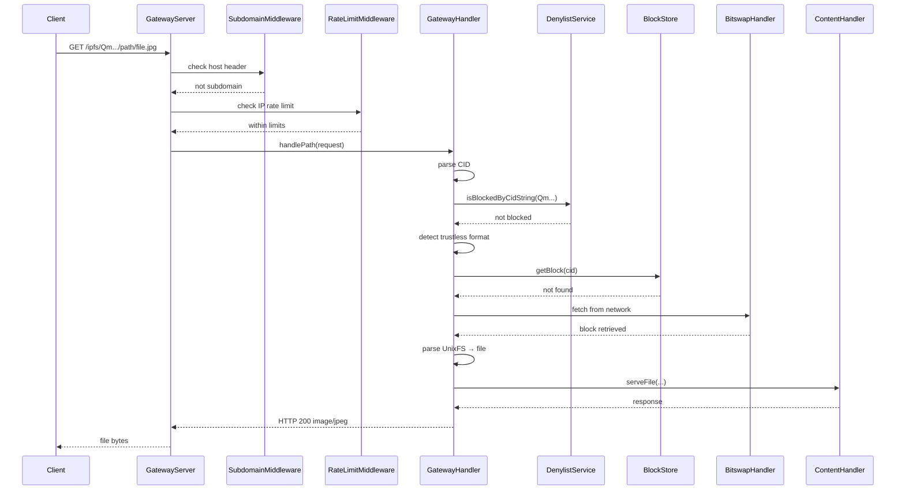
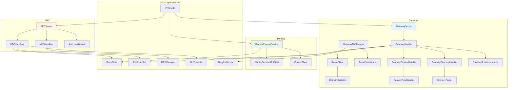

# IPFS — Gateway, RPC & Pinning Services

This note drills into the `lib/src/services/` subsystem: the HTTP gateway, Kubo-compatible RPC API, and pinning service integrations.

## Scope

- `lib/src/services/gateway/` — HTTP gateway, middleware, TLS/AutoTLS, content handlers, directory renderer, trustless formats.
- `lib/src/services/rpc/` — RPC server, `/api/v0/*` handlers, MFS handlers.
- `lib/src/services/pinning/` — Pinning Service API client, remote pinning manager, IPFS Cluster client.

## Gateway (`lib/src/services/gateway/`)

### Architecture layers

| Layer | Components |
|-------|------------|
| Server lifecycle | `GatewayServer` — HTTP server, middleware pipeline, TLS management. |
| Request routing | `GatewayHandler` — path/subdomain parsing, trustless format dispatch, denylist check. |
| Content handlers | `GatewayContentHandler`, `GatewayDirectoryHandler`, `GatewayTrustlessHandler`, `GatewayWssHandler`. |
| Supporting | `ContentTypeHandler`, `DirectoryParser`, `GatewayTlsManager`, `AcmeClient`, `AcmePersistence`, `DomainValidator`. |

### Request flows

**Path-based gateway** (`/ipfs/<cid>` / `/ipns/<name>`)

```
HTTP request
→ Subdomain middleware
→ CORS middleware
→ Rate-limit middleware
→ Metrics middleware
→ Logging middleware
→ Router
→ GatewayHandler.handlePath()
→ denylist check (451 if blocked)
→ trustless format detection (?format= or Accept)
→ blockstore / Bitswap resolution
→ UnixFS file or directory response
```

**Subdomain gateway** (`{cid}.ipfs.{domain}` / `{name}.ipns.{domain}`)

- `*.ipfs.localhost` / `*.ipns.localhost` always supported.
- CIDv0 converted to CIDv1 base32 for DNS compatibility.
- IPNS names resolved via IPNS or DNSLink.
- Subdomain-specific CORS (`Access-Control-Allow-Origin: *`).

### Trustless gateway formats

| Format | Query | Accept header | Status |
|--------|-------|---------------|--------|
| Raw block | `?format=raw` | `application/vnd.ipfs.raw-block` | Complete |
| CAR v1/v2 | `?format=car` | `application/vnd.ipfs.car` | Complete (depth ≤32, blocks ≤10,000) |
| DAG-JSON | `?format=dag-json` | `application/vnd.ipld.dag-json` | Complete |
| DAG-CBOR | `?format=dag-cbor` | `application/vnd.ipld.dag-cbor` | Complete |
| IPNS record | `?format=ipns-record` | `application/vnd.ipfs.ipns-record` | Complete |

### Security features

- `DenylistService` integrated before serving (`_checkDenylist()` → HTTP 451).
- XSS protection in directory listings via `HtmlEscape()` (SEC-005).
- Rate limiting per IP (SEC-007).
- Range request support (`206 Partial Content`).

### TLS / AutoTLS

| Feature | Implementation |
|---------|----------------|
| Manual TLS | `GatewayConfig.certificatePath` + `privateKeyPath` + optional password. |
| AutoTLS (ACME) | RFC 8555 ACME v2 client supporting Let's Encrypt and ZeroSSL; HTTP-01 challenge; RSA 2048 account key; JWS RS256. |
| Persistence | `AcmePersistence` stores keys/certs in `./data/acme/` by default. |
| States | `idle` → `acquiring` → `validating` → `active` → `renewing`. |

## RPC API (`lib/src/services/rpc/`)

### Server

`RPCServer` binds to `localhost:5001` by default with middleware:

1. CORS
2. API-key authentication (SEC-003)
3. Metrics
4. Logging

### Authentication

Public endpoints (no key):

- `POST /api/v0/version`
- `POST /api/v0/id`
- `GET /health`
- `GET /metrics` (if enabled)

All other endpoints require `X-API-Key` header when `apiKey` is configured; comparison is constant-time (SEC-009).

### Implemented `/api/v0/*` endpoints

| Endpoint | Handler | Status |
|----------|---------|--------|
| `/api/v0/version` | `handleVersion` | Complete |
| `/api/v0/id` | `handleId` | Complete |
| `/api/v0/add` | `handleAdd` | Complete (multipart, 1 GB total / 256 MB per file) |
| `/api/v0/cat` | `handleCat` | Complete |
| `/api/v0/get` | `handleGet` | Placeholder (501) |
| `/api/v0/ls` | `handleLs` | Complete |
| `/api/v0/dag/get` | `handleDagGet` | Complete |
| `/api/v0/dag/put` | `handleDagPut` | Complete |
| `/api/v0/dht/findprovs` | `handleDhtFindProviders` | Complete |
| `/api/v0/dht/findpeer` | `handleDhtFindPeer` | Complete |
| `/api/v0/dht/provide` | `handleDhtProvide` | Complete |
| `/api/v0/name/publish` | `handleNamePublish` | Complete |
| `/api/v0/name/resolve` | `handleNameResolve` | Complete |
| `/api/v0/swarm/peers` | `handleSwarmPeers` | Complete |
| `/api/v0/swarm/connect` | `handleSwarmConnect` | Complete |
| `/api/v0/swarm/disconnect` | `handleSwarmDisconnect` | Complete |
| `/api/v0/block/get` | `handleBlockGet` | Complete |
| `/api/v0/block/put` | `handleBlockPut` | Complete |
| `/api/v0/block/stat` | `handleBlockStat` | Complete |

### MFS handlers (`mfs_handlers.dart`)

All `/api/v0/files/*` endpoints are complete:

- `files/ls`, `files/stat`, `files/read`, `files/write`, `files/mkdir`, `files/cp`, `files/mv`, `files/rm`, `files/flush`.
- Delegates to `MFSManager`.
- 100 MiB multipart limit for `files/write`.

### Gateway request sequence diagram



## Pinning services (`lib/src/services/pinning/`)

### Pinning Service API client

`PinningServiceAPIClient` implements the **IPFS Pinning Service API v1**.

- `addPin(PinRequest)` — `POST /pins`
- `listPins(PinListFilter)` — `GET /pins`
- `getPin(requestId)` — `GET /pins/{id}`
- `removePin(requestId)` — `DELETE /pins/{id}`
- `replacePin(requestId, PinRequest)` — `POST /pins/{id}?mode=replace`

Status lifecycle: `queued → pinning → pinned → failed`.

### Remote pinning manager

`RemotePinningService` supports multi-service registration and sync:

- `addService({name, endpoint, token})`
- `pin(...)` / `unpin(...)` / `syncPin(...)` / `syncAll()`
- Tracks `RemotePin` objects keyed by `serviceName:requestId`.
- Persists config automatically.

### IPFS Cluster client

`ClusterClient` is a REST client for existing **IPFS Cluster** deployments (not a full cluster implementation).

- Replication factor: `-1` all, `0` default, `n` min peers.
- Peer allocation control and per-peer status tracking.
- Cluster pin modes: `pin` / `shallow`.

## Services component diagram



## Key files

| File | Purpose |
|------|---------|
| `lib/src/services/gateway/gateway_server.dart` | HTTP server and middleware pipeline. |
| `lib/src/services/gateway/gateway_handler.dart` | Request routing and content resolution. |
| `lib/src/services/gateway/gateway_tls_manager.dart` | TLS/AutoTLS orchestration. |
| `lib/src/services/gateway/acme_client.dart` | ACME v2 client. |
| `lib/src/services/gateway/gateway_content_handler.dart` | File/Raw/CAR serving. |
| `lib/src/services/gateway/gateway_directory_handler.dart` | HTML directory listings. |
| `lib/src/services/gateway/gateway_trustless_handler.dart` | Trustless format responses. |
| `lib/src/services/rpc/rpc_server.dart` | RPC API server. |
| `lib/src/services/rpc/rpc_handlers.dart` | Kubo-compatible `/api/v0/*` handlers. |
| `lib/src/services/rpc/mfs_handlers.dart` | MFS `/api/v0/files/*` handlers. |
| `lib/src/services/pinning/pinning_service_api.dart` | Pinning Service API v1 client. |
| `lib/src/services/pinning/remote_pinning_service.dart` | Multi-service remote pinning manager. |
| `lib/src/services/pinning/cluster_client.dart` | IPFS Cluster REST client. |

## Related

- [[ciel/projects/IPFS/knowledgebase.md|IPFS — Knowledgebase]]
- [[ciel/projects/IPFS/subsystems/core.md|IPFS — Core subsystem]]
- [[ciel/projects/IPFS/subsystems/network-protocols-routing.md|IPFS — Network, Protocols & Routing subsystem]]
- [[ciel/projects/IPFS/subsystems/storage.md|IPFS — Storage subsystem]]
- [[ciel/projects/IPFS/security-and-traps.md|IPFS — Security & Traps]]
