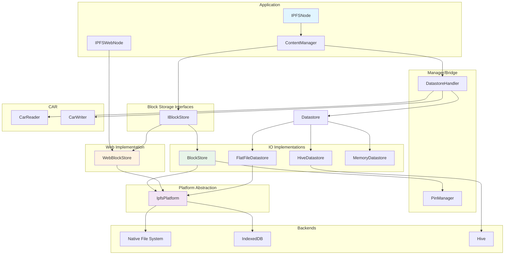

# IPFS — Storage Architecture

This note drills into the storage subsystem of `dart_ipfs`: content-addressed block storage, general-purpose datastores, platform abstraction, and CAR import/export.

## Scope

- `lib/src/core/data_structures/blockstore.dart` and `pin_manager.dart`.
- `lib/src/core/ipfs_node/web_block_store.dart`.
- `lib/src/core/storage/` — `Datastore`, `FlatFileDatastore`, `MemoryDatastore`, `HiveDatastore`.
- `lib/src/core/ipfs_node/datastore_handler.dart`.
- `lib/src/core/data_structures/car.dart`.
- `packages/dart_ipfs_core/lib/src/block/` — core `IBlockStore` interface and `InMemoryBlockStore`.

## Core interfaces

### `IBlockStore` (main package)

`lib/src/core/interfaces/i_block_store.dart`

```dart
abstract class IBlockStore implements ILifecycle {
  Future<GetBlockResponse> getBlock(String cid);
  Future<AddBlockResponse> putBlock(Block block);
  Future<RemoveBlockResponse> removeBlock(String cid);
  Future<bool> hasBlock(String cid);
  Future<List<Block>> getAllBlocks();
  Future<Map<String, dynamic>> getStatus();
  Future<int> gc();
}
```

Uses protobuf responses; lifecycle-aware; includes garbage collection.

### `IBlockStore` (core package)

`packages/dart_ipfs_core/lib/src/block/block_store.dart`

```dart
abstract class IBlockStore {
  Future<void> start();
  Future<void> stop();
  Future<BlockStoreResult<Block?>> getBlock(CID cid);
  Future<BlockStoreResult<void>> putBlock(Block block);
  ...
}
```

Lighter wrapper using `BlockStoreResult<T>`; intended for external plugins.

### `Datastore`

`lib/src/core/storage/datastore.dart`

```dart
abstract class Datastore {
  Future<void> init();
  Future<void> put(Key key, Uint8List value);
  Future<Uint8List?> get(Key key);
  Future<bool> has(Key key);
  Future<void> delete(Key key);
  Stream<QueryEntry> query(Query q);
  Future<void> close();
}
```

General-purpose hierarchical key-value storage.

## Implementations

| Implementation | Platform | Backing store | Key traits |
|----------------|----------|---------------|------------|
| `BlockStore` (`blockstore.dart`) | VM (IO) | Native filesystem via `IpfsPlatform` | In-memory index + lazy disk load; integrated `PinManager`; GC of unpinned blocks. |
| `WebBlockStore` (`web_block_store.dart`) | Web | IndexedDB via `IpfsPlatform` | No in-memory cache; simplified GC placeholder. |
| `InMemoryBlockStore` (core package) | Any | Memory | Testing / ephemeral caching. |
| `FlatFileDatastore` | VM | Filesystem | `<key>.data` files; path-traversal protection. |
| `HiveDatastore` | VM | Hive | Box routing by key prefix: `/blocks/`, `/pins/`, `/dht/`. |
| `MemoryDatastore` | Any | Memory | Default in `IPFSNodeBuilder`; full query support. |

### BlockStore layout (IO)

```
<repo>/
  <cid1>          # block data
  <cid2>
  pins.json       # pin state
```

### WebBlockStore layout (web)

```
IndexedDB: ipfs_storage/files
  blocks/<cid>
  pins/<cid>
```

## BlockStore vs Datastore

| Aspect | BlockStore | Datastore |
|--------|-----------|-----------|
| Key | CID | Hierarchical path string |
| Value | `Block` object (CID + data + format) | Raw `Uint8List` |
| Purpose | Content-addressed DAG storage | Metadata, pins, DHT records, config |
| Indexing | Built-in CID index | Manual query/filter |
| GC | Integrated with `PinManager` | Manual deletion |
| Users | Bitswap, IPLD, content managers | MFS, DHT, pin metadata |

## DatastoreHandler bridge

`DatastoreHandler` (`lib/src/core/ipfs_node/datastore_handler.dart`) exposes block semantics over a `Datastore`:

```dart
Future<void> putBlock(Block block) async {
  final key = Key('/blocks/${block.cid.encode()}');
  await _datastore.put(key, block.data);
}

Future<Block?> getBlock(String cid) async { ... }
```

This lets a single `Datastore` backend satisfy both metadata and block storage needs.

## CAR import/export

`CarReader` / `CarWriter` (`lib/src/core/data_structures/car.dart`, 834 lines) support CAR v1 and v2.

| Component | Role |
|-----------|------|
| `CarHeader` | DAG-CBOR header with roots and version. |
| `CarSection` | `varint(length) + cid_bytes + block_bytes`. |
| `CarReader` | Streaming/iterable; v2 index lookup or linear scan; validates root presence. |
| `CarWriter` | Append-only; optional v2 envelope and index (`IndexSorted`, `MultihashIndexSorted`); max block size 32 MB. |

**Import flow**

```
DatastoreHandler.importCAR(carBytes)
  → CarReader.fromBytes(carBytes)
  → stream CarSection
  → create Block(cid, data, format)
  → DatastoreHandler.putBlock(block)
```

**Export flow**

```
DatastoreHandler.exportCAR(cid)
  → get root block
  → recursive DAG traversal (dag-pb)
  → CarWriter(roots: [rootCid])
  → write each block
  → writer.close()
```

Convenience re-exports in `lib/src/utils/car_reader.dart` and `lib/src/utils/car_writer.dart`.

## Storage layer diagram



## Platform differences

| Feature | IO | Web |
|---------|----|-----|
| Backend | Native filesystem | IndexedDB (`idb_shim`) |
| Directories | Real dirs | Key-prefix emulation |
| Path separator | `\` or `/` | `/` |
| Password prompt | Terminal stdin | Not supported (null) |
| Temp dir | System temp | Timestamped key prefix |
| Concurrency | OS-managed | IndexedDB transactions |

## Security considerations

- **Path traversal**: `FlatFileDatastore` rejects keys containing `..`, `~`, or `:` and normalizes paths.
- **Block validation**: `Block.validate()` must be called on blocks from untrusted peers (SEC-002).
- **CAR validation**: header structure, root presence, section bounds, and CID validity are checked.

## Recommendations from source review

1. Implement `WebBlockStore.gc()` (currently placeholder).
2. Integrate `HiveDatastore` into `IPFSNodeBuilder` as a production IO option.
3. Clarify or consolidate the two `IBlockStore` interfaces.
4. Cache parsed CAR v2 indices for repeated access.

## Key files

| File | Purpose |
|------|---------|
| `lib/src/core/data_structures/blockstore.dart` | IO `BlockStore` with hybrid memory/disk storage. |
| `lib/src/core/data_structures/pin_manager.dart` | Pin state and GC. |
| `lib/src/core/ipfs_node/web_block_store.dart` | IndexedDB-backed web block store. |
| `lib/src/core/storage/datastore.dart` | Datastore interface. |
| `lib/src/core/storage/flat_file_datastore.dart` | File-based datastore with path-traversal guards. |
| `lib/src/core/storage/memory_datastore.dart` | In-memory datastore. |
| `lib/src/storage/hive_datastore.dart` | Hive-backed datastore with prefix routing. |
| `lib/src/core/ipfs_node/datastore_handler.dart` | Bridges Datastore and block operations. |
| `lib/src/core/data_structures/car.dart` | CAR v1/v2 reader/writer/indexer. |
| `packages/dart_ipfs_core/lib/src/block/block_store.dart` | Core `IBlockStore` + result wrapper. |
| `packages/dart_ipfs_core/lib/src/block/memory_block_store.dart` | Core in-memory block store. |

## Related

- [[ciel/projects/IPFS/knowledgebase.md|IPFS — Knowledgebase]]
- [[ciel/projects/IPFS/subsystems/core.md|IPFS — Core subsystem]]
- [[ciel/projects/IPFS/subsystems/platform-utils-cli.md|IPFS — Platform, Utils & CLI subsystem]]
