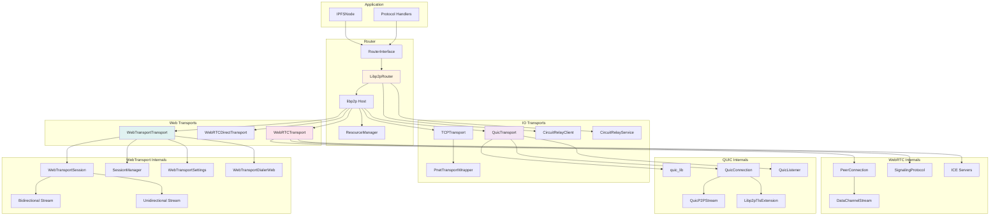

# IPFS — Transport Layer

This note drills into the `lib/src/transport/` subsystem and the external `packages/dart_ipfs_quic/` package: the router abstraction, libp2p transport registration, and platform-specific transport implementations.

## Scope

- `lib/src/transport/` — `RouterInterface`, `Libp2pRouter`, TCP/QUIC/WebRTC/WebTransport/Circuit Relay/PNET.
- `packages/dart_ipfs_quic/lib/src/` — QUIC transport adapter over `quic_lib`.

## Core abstractions

### `RouterInterface`

`lib/src/transport/router_interface.dart` defines the contract between core logic and any P2P router:

- Lifecycle: `initialize()`, `start()`, `stop()`.
- Peer management: `connect()`, `disconnect()`.
- Messaging: `sendMessage()`, `sendRequest()`, `sendMessageWithResponse()`.
- Protocol registration: `registerProtocolHandler()`, `registerProtocol()`.
- Multicast/utility: `broadcastMessage()`, `parseMultiaddr()`, `resolvePeerId()`.

### `Libp2pRouter`

`lib/src/transport/libp2p_router.dart` is the native libp2p implementation backed by `ipfs_libp2p` (v0.5.6):

- Ed25519 peer identity.
- Noise protocol for encryption.
- TCP transport by default; optional QUIC, WebRTC, WebTransport, Circuit Relay.
- Length-prefixed message framing.
- Per-protocol stream handlers.
- Connection, message, and custom event streams.

## Transport registration

Inside `Libp2pRouter.start()`:

```dart
final tcpTransport = TCPTransport(resourceManager: resourceManager);
final wrappedTcp = psk != null
    ? PnetTransportWrapper(inner: tcpTransport, psk: psk)
    : tcpTransport;
final transports = [config.Libp2p.transport(wrappedTcp)];

if (_config.network.enableQuic && supportsQuic) {
  transports.add(config.Libp2p.transport(_quicTransport!));
}
if (_config.network.enableWebTransport) {
  transports.add(config.Libp2p.transport(webTransportTransport));
}
if (_config.network.enableWebRtc) {
  transports.add(config.Libp2p.transport(webrtcTransport));
  transports.add(config.Libp2p.transport(webrtcDirectTransport));
}
```

## Transport availability by platform

| Transport | IO (Native) | Web (Browser) | Notes |
|-----------|-------------|---------------|-------|
| TCP | Full | N/A | Provided by `ipfs_libp2p`. |
| QUIC | Full (via `dart_ipfs_quic`) | N/A | Pure-Dart, currently default-off. |
| WebRTC | Stub | Full | WebRTC only practical in browsers today. |
| WebTransport | Stub | Full | HTTP/3 browser API. |
| Circuit Relay | Full | Stub | v2 HOP/STOP; web support pending. |
| PNET | Full | Limited | XSalsa20 private network over TCP. |

## TCP & Private Network (PNET)

- `TCPTransport` from `ipfs_libp2p` is the default native transport.
- `PnetTransportWrapper` (`lib/src/transport/pnet/pnet_transport_wrapper.dart`) wraps TCP with the libp2p private-network nonce handshake and XSalsa20 stream encryption.
- PSK loading order: `NetworkConfig.privateNetworkPsk` → `NetworkConfig.swarmKeyPath` → default `/data/ipfs/swarm.key`.

## QUIC (`packages/dart_ipfs_quic`)

| Class | File | Role |
|-------|------|------|
| `QuicTransport` | `lib/src/quic_transport.dart` | Implements `ipfs_libp2p.Transport` for `/ip4/udp/quic-v1` and `/ip6/udp/quic-v1`. |
| `QuicConnection` | `lib/src/quic_transport.dart` | `TransportConn` adapter; ALPN/peer verification, libp2p TLS extension validation. |
| `QuicListener` | `lib/src/quic_listener.dart` | `Listener` wrapping incoming `quic_lib` connections. |
| `QuicP2PStream` | `lib/src/quic_p2p_stream.dart` | Adapts QUIC streams to `P2PStream<Uint8List>`. |
| `Libp2pTlsHandshakeVerifier` | `lib/src/libp2p_tls_extension.dart` | Verifies libp2p TLS 1.3 extension OID `1.3.6.1.4.1.53594.1.1`; Ed25519-only currently. |

The umbrella package probes for `dart_ipfs_quic` availability at startup; if the package is present, QUIC listen addresses are synthesized on port `4002` when enabled.

## WebRTC transport

`lib/src/transport/webrtc/`

| Class | Role |
|-------|------|
| `WebRTCTransport` | Relay-mode WebRTC (`/webrtc`) over circuit relay for signaling. |
| `WebRTCDirectTransport` | Direct-mode WebRTC (`/webrtc-direct`) via HTTP SDP exchange. |
| `PeerConnection` (web) | Browser WebRTC implementation using `package:web`; ICE/SDP handling. |
| `PeerConnection` (IO) | Stub (`UnimplementedError`). |
| `SignalingProtocol` | `/libp2p/webrtc/1.0.0/signaling` — offer/answer/candidate exchange. |
| `IceServer` | STUN/TURN configuration from `NetworkConfig`. |

**Direct mode flow**

```
Parse /ip4/IP/udp/PORT/webrtc-direct/certhash/ALG/HASH/p2p/PEER_ID
→ Create PeerConnection
→ Create offer, set local description
→ POST SDP to http://IP:PORT/libp2p-webrtc
→ Receive answer, set remote description
→ Wait for data channel
→ Return WebRTCConnection
```

## WebTransport transport

`lib/src/transport/webtransport/`

| Class | Role |
|-------|------|
| `WebTransportTransport` | HTTP/3 WebTransport (RFC 9220) transport. |
| `WebTransportSession` | Session management: bi/uni streams, datagrams, graceful close, flow control. |
| `WebTransportSessionManager` | Max 100 concurrent sessions, registration/cleanup. |
| `WebTransportSettings` | HTTP/3 SETTINGS negotiation. |
| `WebTransportDialerWeb` | Browser `web.WebTransport` API with certificate-hash validation. |
| `WebTransportDialerIO` | Stub (`UnimplementedError`). |
| `MultiaddrParser` | Parses `/certhash/ALGORITHM/HASH`. |

Key settings IDs: `SETTINGS_ENABLE_CONNECT_PROTOCOL` (0x08), `SETTINGS_H3_DATAGRAM` (0x33), `SETTINGS_WEBTRANSPORT_ENABLED` (0x2c7cf000), flow-control/stream-count settings, and `SETTINGS_WT_MAX_SESSIONS` (0x2b66) for dart_ipfs session limit.

## Circuit Relay

| Class | File | Role |
|-------|------|------|
| `CircuitRelayClientIO` | `circuit_relay_client_io.dart` | HOP client: `RESERVE`, `CONNECT`, reservation refresh, circuit limits. |
| `CircuitRelayService` | `circuit_relay_service.dart` | HOP/STOP server, reservation handling, packet forwarding. |
| `CircuitRelayClientWeb` | `circuit_relay_client_web.dart` | Stub. |

Default reservation limits: 1 GB data, 2 hours duration.

## Protocol IDs

| Protocol | ID |
|----------|----|
| WebRTC Signaling | `/libp2p/webrtc/1.0.0/signaling` |
| Circuit Relay HOP | `/libp2p/circuit/relay/0.2.0/hop` |
| Circuit Relay STOP | `/libp2p/circuit/relay/0.2.0/stop` |
| Circuit Relay Transport | `/libp2p/circuit/relay/0.2.0/transport` |
| WebRTC | `/webrtc` |
| WebRTC Direct | `/webrtc-direct` |
| WebTransport | `/webtransport` |
| QUIC | `/quic-v1` |
| TCP | `/tcp` |

## Transport component diagram



## Multiaddr examples

| Transport | Example |
|-----------|---------|
| TCP | `/ip4/127.0.0.1/tcp/4001/p2p/Qm...` |
| QUIC | `/ip4/127.0.0.1/udp/4002/quic-v1/p2p/Qm...` |
| WebRTC Direct | `/ip4/127.0.0.1/udp/4003/webrtc-direct/certhash/sha-256/.../p2p/Qm...` |
| WebTransport | `/ip4/127.0.0.1/udp/4002/quic-v1/webtransport/certhash/sha-256/.../p2p/Qm...` |
| WebRTC Relay | `/ip4/RELAY/udp/PORT/quic-v1/webtransport/p2p/RELAY_ID/p2p-circuit/webrtc/p2p/REMOTE_ID` |

## Network configuration defaults

From `NetworkConfig` (`lib/src/core/config/network_config.dart`):

```dart
enableWebTransport: true
enableWebRtc: true
enableQuic: false          // off by default until ipfs_libp2p exposes QUIC
quicListenPort: 4002
preferQuic: false
stunServers: []
turnServers: []
```

Default listen addresses:

```
/ip4/0.0.0.0/tcp/4001
/ip6::/tcp/4001
/ip4/0.0.0.0/udp/4002/quic-v1/webtransport
```

## Key files

| File | Purpose |
|------|---------|
| `lib/src/transport/router_interface.dart` | Router contract. |
| `lib/src/transport/libp2p_router.dart` | Native libp2p router (936 lines). |
| `lib/src/transport/router_events.dart` | Event types and network packets. |
| `lib/src/transport/pnet/pnet_transport_wrapper.dart` | PNET encryption wrapper. |
| `lib/src/transport/webrtc/*.dart` | WebRTC transport and signaling. |
| `lib/src/transport/webtransport/*.dart` | WebTransport transport/session/dialer. |
| `lib/src/transport/circuit_relay_client_io.dart` | Circuit Relay v2 HOP client. |
| `lib/src/transport/circuit_relay_service.dart` | Circuit Relay v2 server. |
| `packages/dart_ipfs_quic/lib/src/quic_transport.dart` | QUIC transport adapter. |
| `packages/dart_ipfs_quic/lib/src/libp2p_tls_extension.dart` | libp2p TLS verification. |
| `lib/src/core/config/network_config.dart` | Transport flags and addresses. |

## Related

- [[ciel/projects/IPFS/knowledgebase.md|IPFS — Knowledgebase]]
- [[ciel/projects/IPFS/subsystems/core.md|IPFS — Core subsystem]]
- [[ciel/projects/IPFS/subsystems/network-protocols-routing.md|IPFS — Network, Protocols & Routing subsystem]]
- [[ciel/projects/IPFS/subsystems/platform-utils-cli.md|IPFS — Platform, Utils & CLI subsystem]]
- [[ciel/projects/IPFS/dependencies-and-monorepo.md|IPFS — Dependencies & Monorepo]]
